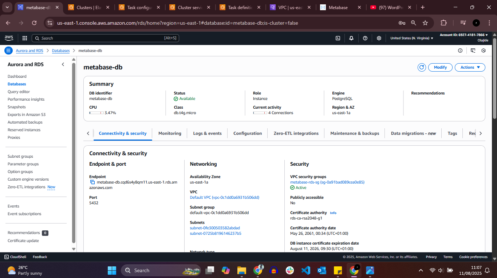
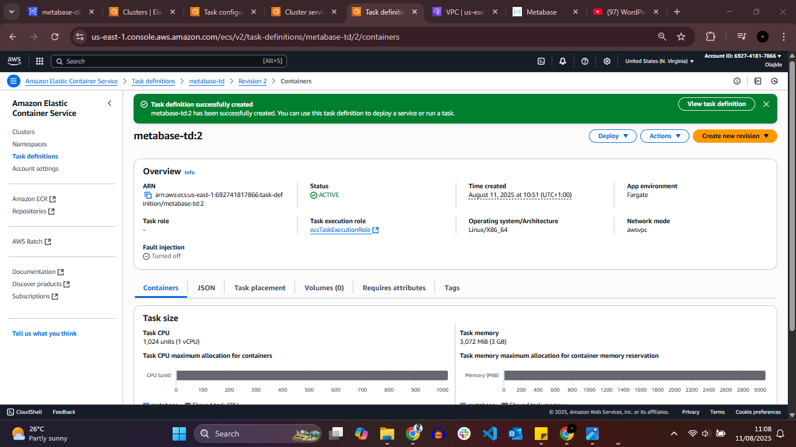
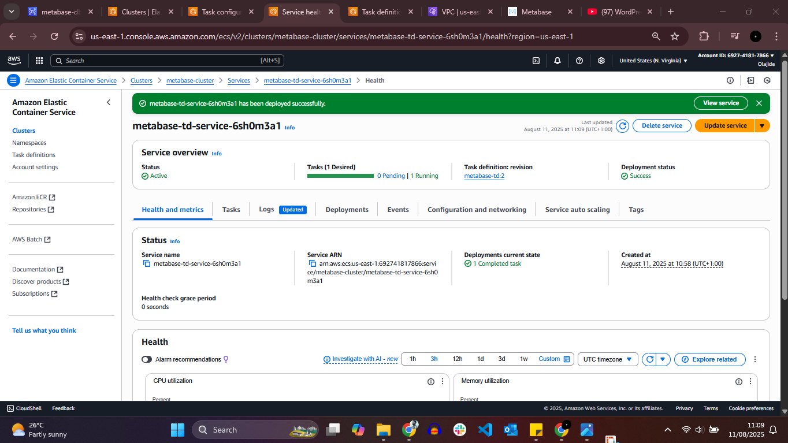
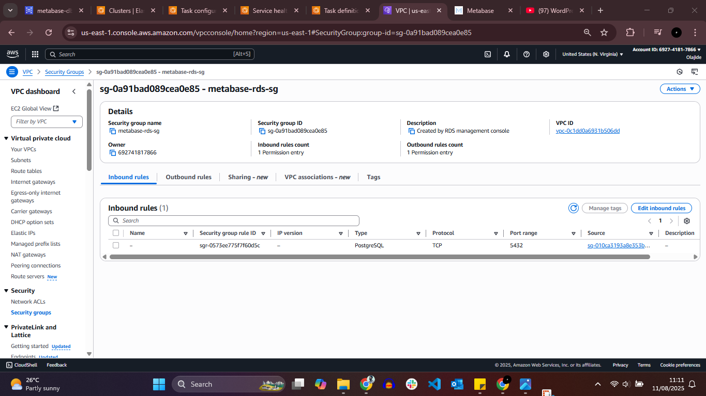

# Metabase Deployment on Amazon ECS with RDS PostgreSQL

## 📌 Project Overview
This project demonstrates the deployment of **Metabase** on **Amazon Elastic Container Service (ECS)** using the **Fargate launch type**, integrated with a **PostgreSQL database hosted on Amazon RDS**.

The deployment uses the official Metabase Docker image and follows AWS security best practices by ensuring private network communication between ECS tasks and the RDS database.

---

## 🛠️ Services Used
- Amazon ECS
- AWS Fargate
- Amazon RDS (PostgreSQL)
- Amazon VPC
- Security Groups
- Docker (Metabase official image)

---

## 📋 Task Summary
- Deployed Metabase using **Amazon ECS with Fargate**
- Used the official Docker image from Docker Hub
- Configured all required **database environment variables** in the ECS task definition
- Deployed ECS tasks and RDS instance within the **same VPC**
- Restricted database access using **security group-to-security group rules**
- Ensured the RDS instance was **not publicly accessible**

---

## ⚙️ Configuration Details

### ECS Task Definition
- **Launch Type:** Fargate
- **Container Image:** metabase/metabase
- **Network Mode:** awsvpc
- **Public IP:** Disabled (private communication)

### Environment Variables Configured
The following environment variables were defined in the ECS task definition to enable database connectivity:

- `MB_DB_TYPE=postgres`
- `MB_DB_DBNAME=<database_name>`
- `MB_DB_HOST=<rds_endpoint>`
- `MB_DB_PORT=5432`
- `MB_DB_USER=<db_username>`
- `MB_DB_PASS=<db_password>`

---

## 🗄️ RDS PostgreSQL Configuration
- **Engine:** PostgreSQL
- **Deployment:** Private subnet
- **Public Access:** Disabled
- **Port:** 5432

---

## 🔐 Security Configuration
- **RDS Security Group:**
  - Inbound rule allows **TCP port 5432**
  - Source restricted to **ECS task security group only**
- **ECS Security Group:**
  - Allows outbound traffic to the RDS instance

This setup ensures the database is isolated from the public internet and accessible only by authorized ECS tasks.

---

## 📸 Screenshots Evidence

### 1️⃣ ECS Cluster & Running Service

### 2️⃣ Task Definition – Metabase Image & Environment Variables

### 3️⃣ RDS PostgreSQL Instance

### 4️⃣ Security Group Configuration

---

## 🎯 Key Learnings
- Deploying stateful applications using ECS Fargate
- Integrating containerized applications with Amazon RDS
- Managing sensitive configuration via environment variables
- Implementing secure, private service-to-database communication

---

## 🚀 Use Case
This architecture is suitable for:
- Business intelligence and analytics platforms
- Secure internal dashboards
- Production-ready containerized applications with managed databases

---
