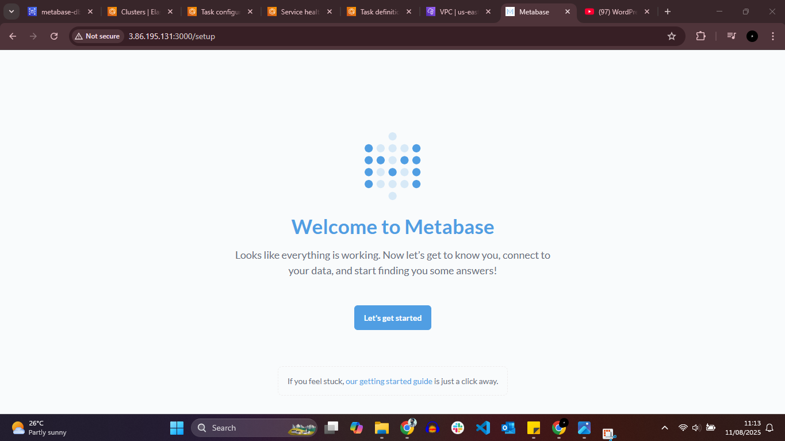
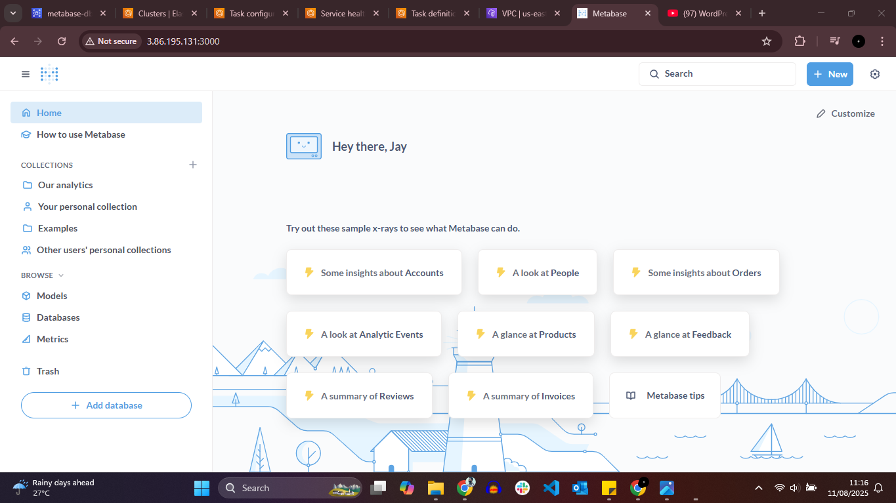

# Metabase Deployment on Amazon ECS (Fargate) with PostgreSQL RDS Backend

## 📌 Project Overview
This project demonstrates the deployment of **Metabase**, an open-source business intelligence (BI) and analytics platform, on **Amazon Elastic Container Service (ECS)** using the **Fargate launch type**, integrated with a **PostgreSQL database hosted on Amazon RDS**.

The deployment follows AWS security best practices by ensuring **private network communication** between ECS tasks and the RDS instance and restricting database access using **security group referencing**.

---

## 🛠️ Services Used
- Amazon ECS (Fargate)
- Amazon RDS (PostgreSQL)
- Amazon VPC
- AWS Security Groups
- Docker (Metabase official image)

---

## 📋 Task Summary
- Deployed Metabase using **Amazon ECS with Fargate**
- Integrated Metabase with **PostgreSQL database hosted on Amazon RDS**
- Used the official Docker image: `metabase/metabase`
- Configured all required **database environment variables** inside the ECS task definition
- Deployed ECS tasks and RDS within the **same VPC** for private communication
- Secured database access using **security group rules that allow only ECS-originated traffic**

---

## ⚙️ Configuration Details

### ECS Task Definition Environment Variables
The following environment variables were configured to enable database connectivity:

- `MB_DB_TYPE=postgres`
- `MB_DB_DBNAME=<database-name>`
- `MB_DB_HOST=<rds-endpoint>`
- `MB_DB_PORT=5432`
- `MB_DB_USER=<db-username>`
- `MB_DB_PASS=<db-password>`

> ⚠️ Sensitive values were securely configured and are not exposed in this repository.

---

### Network & Security Architecture
- ECS tasks and the RDS instance were deployed **inside the same VPC**
- RDS database was **not publicly accessible**
- RDS security group allows inbound **TCP traffic on port 5432 only from the ECS task security group**
- No public database exposure

---

## 🔐 Security Configuration

### RDS Security Group
- **Inbound Rule:**
  - Protocol: TCP  
  - Port: 5432  
  - Source: ECS Task Security Group only  

This ensures **only the Metabase container can access the database**, preventing unauthorized access.

---

## 📸 Screenshots Evidence

### 1️⃣ Metabase Database (PostgreSQL - RDS)

### 2️⃣ ECS Task Definition

### 3️⃣ Running ECS Service

### 4️⃣ Security Group Rule (ECS → RDS on Port 5432)

### 5️⃣ Metabase Successfully Setup (Screen 1)

### 6️⃣ Metabase Successfully Setup (Screen 2)

---

## 🎯 Key Learnings
- Deploying multi-tier containerized applications on AWS
- Integrating ECS services with Amazon RDS
- Managing sensitive configuration using environment variables
- Implementing secure inter-service communication using security group referencing
- Designing private and secure cloud architectures

---

## 🚀 Use Case
This architecture is ideal for:
- Business intelligence platforms
- Internal analytics dashboards
- Secure cloud-native application deployments
- Enterprise data visualization solutions
